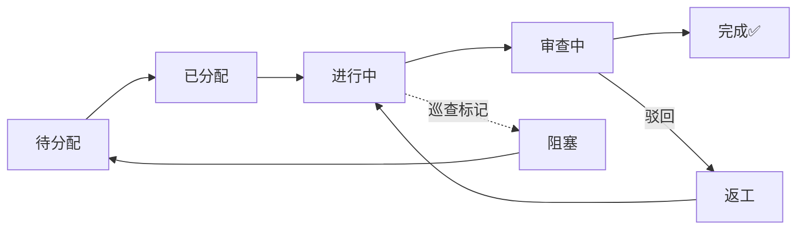

# SuperClaw 🦞

<p align="center">
  
</p>

<p align="center"><b>会自我进化的多 Agent 系统 · 内置 300+ Skills · 开箱即用</b></p>

<p align="center">
  <a href="https://github.com/openclaw/openclaw"></a>
  
  
  
  
  
</p>

<p align="center">
  🧠 <a href="#系统架构">架构</a> · 
  🧬 <a href="#进化引擎--superclaw-的灵魂">进化引擎</a> · 
  🛠️ <a href="#300-skills">Skills</a> · 
  🖥️ <a href="#虚拟办公室--可视化-agent-协作">虚拟办公室</a> · 
  ⚡ <a href="#快速启动">快速启动</a> ·
  🌐 <a href="README_EN.md">English</a>
</p>

---

> **AI 自己管自己、自己修自己、自己进化自己。**
>
> SuperClaw 是一个多 Agent 自组织协作平台：4 个 AI Agent 各司其职，自主规划-执行-审查-巡检。在此之上，**进化引擎**持续分析每次会话，自动修复出错的 Skill、衍生更强的 Skill、从成功案例中捕获新 Skill。

SuperClaw 基于 [OpenMOSS](https://github.com/uluckyXH/OpenMOSS) 多 Agent 调度框架构建，在此基础上新增了：

| 新增能力 | 说明 |
|---------|------|
| 🧬 **进化引擎** | 后台守护进程，分析 session → 自动修复/衍生/捕获 Skill，Agent 越用越强 |
| 🛠️ **300+ 预置 Skills** | 生信、医学、化学、文献、数据科学、文档生成…… 全领域覆盖 |
| 🔄 **会话自动恢复** | Agent 对话中断？自动检测、自动续跑、自动通知 |
| 📱 **Telegram 深度集成** | Bot 对话 + 文件代理 + Webhook 守护 + 通知推送 |
| 🖥️ **虚拟办公室** | 2D/3D 实时渲染 Agent 协作，像看一间 AI 办公室 |
| 🐕 **看门狗** | 网关健康监控 + 自动重启 + 告警 |

---

## 实际使用案例

### 案例一：全自动英文新闻站

[1M Reviews](https://1m-reviews.com/) 是一个**完全由 Agent 团队自主运营**的英文新闻站。人类只下达了一个目标：

> 搜集中文互联网的 AI / 科技 / 数码 / 汽车资讯，翻译成英文后发布到 WordPress。

**结果：**
- 🚀 **2 天内自主发布 20+ 篇文章**，全程无人干预
- 🔄 Agent 团队遇到问题**自行协作解决**，始终稳定推进
- 🖼️ 被要求加图片后，Agent 在第 10 轮自动测通功能并应用到后续所有任务

### 案例二：生物实验报告撰写

用户发了一组实验数据（考马斯亮蓝法测蛋白质含量），SuperClaw 自动完成：

1. **读取并理解实验数据** — 识别标准曲线、样品浓度、吸光度
2. **绘制标准曲线和 HW 图** — 调用 matplotlib Skill，自动标注 R² 值
3. **生成符合格式规范的 DOCX 报告** — 按照论文格式硬性规则（小四宋体、三号黑体标题、图表编号等）排版
4. **多轮自审修正** — 检查图表标题中英文对照、页边距、字号，不合格自动修

全程用户只发了原始数据 + 一句"帮我写实验报告"。

### 案例三：个人陈述 + 简历生成

用户提供成绩单 PDF，要求写留学申请材料：

1. **PDF 解析** — 自动提取课程、绩点、学校信息
2. **个人陈述撰写** — 结合学术背景生成 Personal Statement，DOCX 输出
3. **简历排版** — 单页简历，英文排版，自动调整间距
4. **多版本迭代** — 用户反馈后快速生成 v2、v3

### 案例四：小红书视频理解

SuperClaw 可以搜索小红书、下载视频、用 Gemini 分析内容：

1. 用户说"搜一下足球技巧教学的视频"
2. Agent 自动打开浏览器 → 搜索 → 从 Pinia store 提取 20 条视频笔记
3. 下载第一个视频（11MB）
4. 上传给 Gemini 3.1 Pro 分析 → 输出详细的训练步骤

### 案例五：GWAS 全基因组关联分析

用户给了一个表型数据文件：

1. Agent 查阅 `labclaw-bio-gwas-database` Skill
2. 使用 R 的 rrBLUP 包进行 GWAS 分析
3. 自动生成曼哈顿图 + QQ 图（出版级质量）
4. 输出显著 SNP 位点列表

---

## 系统架构

### 四个 Agent，各司其职

```
┌─────────────────────────────────────────────────────────────┐
│                      SuperClaw 平台                          │
│                                                              │
│  ┌──────────┐  ┌──────────┐  ┌──────────┐  ┌──────────┐    │
│  │  规划者   │  │  执行者   │  │  审查者   │  │  巡查者   │    │
│  │ 🧠 拆任务 │  │ 💻 干活  │  │ 🔍 审查  │  │ 🛡️ 巡检  │    │
│  └────┬─────┘  └────┬─────┘  └────┬─────┘  └────┬─────┘    │
│       └──────────────┴──────────────┴──────────────┘          │
│                          │                                    │
│                    ┌─────┴──────┐                             │
│                    │  任务队列   │                             │
│                    │  (FastAPI)  │                             │
│                    └─────┬──────┘                             │
│                          │                                    │
│  ┌────────────────────────────────────────────────────────┐  │
│  │                   支撑服务层                             │  │
│  │  进化引擎 · 会话监控 · 看门狗 · Telegram · 文件代理      │  │
│  └────────────────────────────────────────────────────────┘  │
│                          │                                    │
│                    ┌─────┴──────┐                             │
│                    │  300+ Skills│                            │
│                    │  （可插拔） │                            │
│                    └────────────┘                             │
└─────────────────────────────────────────────────────────────┘
```

### Agent 角色详解

| 角色 | 做什么 | 怎么工作 |
|------|--------|---------|
| **规划者 (Planner)** | 拆解用户目标为子任务，分配给执行者，跟进进度，收尾交付 | 收到目标 → 拆分模块和子任务 → 分配 → 监控完成情况 → 汇总交付 |
| **执行者 (Executor)** | 认领子任务，实际执行（写代码、写文档、搜索、分析），提交成果 | 定时唤醒 → 认领任务 → 查 Skill → 执行 → 提交审查 |
| **审查者 (Reviewer)** | 检查执行者的交付物质量，评分，通过或驳回返工 | 收到审查请求 → 逐项检查 → 评分 → 通过/驳回 + 修改意见 |
| **巡查者 (Patrol)** | 监控系统健康，发现卡住的任务自动标记，发告警 | 定时巡检 → 检查阻塞任务 → 标记 + 通知 → 触发恢复 |

### 任务生命周期



人类只需要在第一步设定目标，后续全部自动：

```
人类设定目标 → 规划者拆任务 → 执行者干活 → 审查者把关 → 巡查者兜底
```

### 工作流程：规划 → 暂停 → 批准 → 执行 → 自审 → 交付

SuperClaw 有一个**核心安全机制**：Agent 收到任务后**必须先输出方案，然后暂停等待用户批准**。这防止了 Agent "闷头干活" 导致的 token 浪费和方向错误。

```
用户: "帮我做一个 GWAS 分析"
    ↓
Agent: "📋 我的方案：1. 读取数据 2. 质控 3. 关联分析 4. 画图。可以开始吗？"
    ↓ (暂停，等用户说 OK)
用户: "可以"
    ↓
Agent: (查阅 Skill → 执行 → 自审 → 交付)
```

---

## 进化引擎 — SuperClaw 的灵魂

这是 SuperClaw 与普通多 Agent 系统最大的区别。**Agent 用得越多，越聪明。**

### 三种进化触发

| 触发类型 | 触发条件 | 进化动作 | 举例 |
|---------|---------|---------|------|
| **FIX（修复）** | Skill 被使用但效果差或报错 | LLM 分析错误原因，修补 Skill | Agent 用 `iterative-ppt-generation` Skill 做 PPT，但 python-pptx 报错 → 引擎分析日志 → 修复 Skill 里的代码模板 |
| **DERIVED（衍生）** | Skill 有效但存在优化空间 | LLM 生成增强版 Skill | `adaptive-web-search` 能用但不够深 → 引擎衍生出 `adaptive-web-search-enhanced`，加了自动翻页和多源交叉验证 |
| **CAPTURED（捕获）** | 没有匹配的 Skill，但任务成功了 | LLM 从成功的 session 中提取新 Skill | Agent 手动写了一套 DOCX 格式化脚本，效果很好 → 引擎捕获为 `chinese-standard-docx-styling` Skill |

### 进化引擎工作原理

```
                      ┌─────────────────┐
                      │  Agent Session   │
                      │  (对话历史)       │
                      └────────┬────────┘
                               │ 每 30 秒检查
                               ▼
                      ┌─────────────────┐
                      │  进化引擎 Daemon  │
                      │  (evolution-     │
                      │   engine.py)     │
                      └────────┬────────┘
                               │ LLM 分析
                               │ (Gemini Flash / Grok Mini)
                               ▼
              ┌────────────────┼────────────────┐
              │                │                │
         ┌────┴────┐    ┌────┴────┐    ┌────┴────┐
         │  FIX    │    │ DERIVED │    │CAPTURED │
         │ 修复坏的 │    │ 增强好的 │    │ 捕获新的 │
         └────┬────┘    └────┬────┘    └────┬────┘
              │              │              │
              └──────────────┼──────────────┘
                             │
                             ▼
                      ┌─────────────────┐
                      │   skills/ 目录   │
                      │  Agent 自动加载   │
                      └─────────────────┘
```

引擎用轻量 LLM（Gemini Flash / Grok Mini）做分析，控制成本。进化后的 Skill 直接写入 `skills/` 目录，Agent 下次执行时自动加载——**无需重启，无需人工干预**。

### 进化的实际效果

以下是进化引擎自动生成的 Skill 示例（真实数据）：

| 原始 Skill | 进化后 | 触发类型 | 改进点 |
|-----------|--------|---------|--------|
| `adaptive-web-search` | `adaptive-web-search-enhanced` | DERIVED | 增加多源交叉验证、自动翻页 |
| `iterative-ppt-generation` | `iterative-ppt-generation-enhanced` | FIX | 修复 python-pptx 兼容性问题 |
| _(无)_ | `chinese-standard-docx-styling` | CAPTURED | 从成功的 DOCX 排版 session 中捕获 |
| _(无)_ | `script-driven-docx-composition` | CAPTURED | 从 Python 脚本生成 DOCX 的 session 中捕获 |
| `browser-visual-diagnose` | `browser-visual-diagnose-enhanced` | DERIVED | 增强截图分析的准确度 |
| _(无)_ | `bio-educational-interpreter` | CAPTURED | 从生物学概念解释的成功 session 中捕获 |

---

## 300+ Skills

SuperClaw 内置 300+ 预构建 Skills，每个 Skill 就是一个目录里的 `SKILL.md` 文件（纯 Markdown 提示词），Agent 按需加载。

### Skill 分类

| 类别 | 数量 | 具体内容 |
|------|------|---------|
| **生信 (labclaw-bio-\*)** | 100+ | 基因组学（BLAST、Ensembl、UniProt）、单细胞（Scanpy、AnnData、CellxGene）、蛋白质结构（AlphaFold、ESM）、通路分析、GWAS、代谢组学、空间转录组 |
| **医学 (labclaw-med-\*)** | 30+ | 临床决策支持、ClinVar 变异解读、临床试验匹配、精准肿瘤学、罕见病诊断、药物相互作用、影像分析 |
| **药学/化学 (labclaw-pharma-\*)** | 30+ | ChEMBL 搜索、RDKit 分子操作、分子对接、药物设计、ADMET 预测、逆合成、蛋白配体互作 |
| **文献 (labclaw-literature-\*)** | 15+ | PubMed 搜索、引文管理、综述写作、科学写作、文献深度调研 |
| **数据科学 (labclaw-general-\*)** | 40+ | 统计分析、机器学习（scikit-learn、PyTorch）、可视化（matplotlib、seaborn）、Jupyter 集成 |
| **R 语言 (posit-\*)** | 10+ | ggplot2、Shiny、R Markdown、Tidyverse、测试、部署 |
| **通用工具** | 40+ | PPT 生成、DOCX 排版、网络搜索、视频理解（Gemini）、图像分析、论文写作、小红书爬取 |
| **Agent 核心** | 4 | 规划者、执行者、审查者、巡查者（4 Agent 框架核心） |

### Skill 目录结构

```
skills/
├── labclaw-bio-bioinformatics/
│   └── SKILL.md              # Skill 提示词 + 使用说明
├── labclaw-bio-scanpy/
│   └── SKILL.md
├── labclaw-pharma-rdkit/
│   └── SKILL.md
├── task-planner-skill/
│   └── SKILL.md              # Agent 核心 Skill
├── task-cli.py                # 共享的任务 API 客户端
└── ...（300+ 个目录）
```

Skill 是纯 Markdown 提示词，不需要代码执行框架。Agent 通过 OpenClaw 原生 Skill 系统加载。

---

## 虚拟办公室 — 可视化 Agent 协作

SuperClaw 包含一个独立的可视化前端（`office/` 目录），将 Agent 协作过程渲染为一间虚拟办公室。


### 功能

- **2D 平面图** — SVG 等距办公室，Agent 有头像、工位、实时状态动画（空闲/工作/说话/调用工具/报错）
- **3D 场景** — React Three Fiber 3D 办公室，角色模型 + Skill 全息投影 + 特效
- **协作连线** — 可视化 Agent 之间的消息流动
- **对话气泡** — 实时 Markdown 流式输出 + 工具调用展示
- **监控面板** — Token 使用量折线图、费用饼图、活跃度热力图、事件时间线
- **聊天界面** — 直接从办公室 UI 向 Agent 发消息


```bash
cd office
npm install
npm run dev    # http://localhost:5173
```

---

## 支撑服务

SuperClaw 不只是一个任务调度器，它还有一套完整的运维体系：

### 会话监控 (`session-watcher.py`)

Agent 对话中断（"死掉"）是多 Agent 系统最常见的问题。会话监控自动处理：

- 每 15 秒检查最新 session 文件
- 检测到 Agent 异常结束（空 assistant 消息）→ 自动发送续跑消息
- 最多续跑 5 轮，超过则通知用户
- 通过 Telegram 推送恢复状态

### 看门狗 (`watchdog.py`)

网关健康监控：

- 每 2 分钟检查 OpenClaw gateway 进程
- 连续 5 次检测失败 → 自动重启 gateway
- 重启后自动重新注册 Telegram Webhook
- 通过 Telegram 推送告警

### Webhook 守护 (`webhook-guardian.py`)

确保 Telegram Webhook 始终在线：

- 定期 Webhook 健康检查
- 证书/连接问题自动重新注册
- TLS 证书管理

### Telegram 文件代理 (`telegram-file-proxy.py`)

打通 Telegram 和 Agent 之间的文件传输：

- 接收用户发给 Bot 的文件
- 通过本地 HTTP 提供给 Agent 使用
- 支持大文件下载

### Scite Token 管理器 (`scite-token-manager.py`)

管理 Scite.ai 学术搜索 API 的认证 token，定时刷新，Telegram 通知过期。

---

## 快速启动

### 环境要求

- Python 3.10+
- [OpenClaw](https://github.com/openclaw/openclaw) 已安装配置
- Node.js 18+（仅构建前端时需要）

### 安装与运行

```bash
# 1. 克隆项目
git clone https://github.com/luokehan/superclaw.git
cd superclaw

# 2. 安装 Python 依赖
pip install -r requirements.txt

# 3. 启动服务
python -m uvicorn app.main:app --host 0.0.0.0 --port 6565
```

首次启动后访问 `http://localhost:6565`，**设置向导**会引导你完成：

1. 设置管理员密码
2. 配置项目名称和工作目录
3. 生成 Agent 注册令牌
4. 可选配置通知渠道（Telegram）

### 启动支撑服务

```bash
# 进化引擎（Skill 自动进化）
python evolution-engine.py &

# 会话监控（自动恢复中断的任务）
python session-watcher.py &

# 看门狗（网关健康监控）
python watchdog.py &

# Webhook 守护（Telegram Webhook 健康检查）
python webhook-guardian.py &
```

### 配置 Agent

每个 Agent 需要：

1. 一个 [OpenClaw](https://github.com/openclaw/openclaw) 实例
2. 从 `prompts/` 加载对应角色提示词
3. 从 `skills/` 加载对应角色的 Skill
4. 用注册令牌调用 SuperClaw API 完成注册

详细的部署教程见 [部署指南](docs/deployment-guide.md)。

---

## 配置说明

复制 `config.example.yaml` 为 `config.yaml`：

```yaml
project:
  name: "SuperClaw"

admin:
  password: "你的安全密码"  # 首次启动自动 bcrypt 加密

agent:
  registration_token: "你的随机令牌"
  allow_registration: true

notification:
  enabled: true
  channels:
    - type: telegram
      bot_token: "你的_BOT_TOKEN"
      chat_id: "你的_CHAT_ID"
  events:
    - task_completed      # 子任务完成
    - review_rejected     # 审查驳回（返工）
    - all_done            # 全部完成
    - patrol_alert        # 巡查告警

server:
  port: 6565
  host: "0.0.0.0"

database:
  type: sqlite
  path: "./data/tasks.db"

workspace:
  root: "/你的/工作目录"
```

| 配置项 | 默认值 | 说明 |
|-------|--------|------|
| `admin.password` | `admin123` | **必改** — 管理员密码，首次启动自动加密 |
| `agent.registration_token` | — | **必改** — Agent 注册令牌 |
| `workspace.root` | `./workspace` | **必改** — Agent 工作目录 |
| `notification.enabled` | `false` | 是否开启通知推送 |
| `webui.public_feed` | `false` | 是否公开活动流页面 |
| `webui.feed_retention_days` | `7` | 请求日志保留天数 |

---

## API 文档

启动后访问 `http://localhost:6565/docs` 查看完整 Swagger 文档。

### 认证方式

| 身份 | Header | 说明 |
|------|--------|------|
| Agent | `X-Agent-Key: <api_key>` | Agent 注册后获得 |
| 管理员 | `X-Admin-Token: <token>` | 登录接口返回 |
| 注册 | `X-Registration-Token: <token>` | 配置文件里设置 |

### WebUI 页面

| 页面 | 路径 | 说明 |
|------|------|------|
| 设置向导 | `/setup` | 首次初始化 |
| 仪表盘 | `/dashboard` | 系统概览、统计图表 |
| 任务管理 | `/tasks` | 任务列表、模块、子任务 |
| Agent 管理 | `/agents` | Agent 状态、角色、工作量 |
| 活动流 | `/feed` | 实时 Agent API 活动 |
| 积分排行 | `/scores` | Agent 评分排名 |
| 审查记录 | `/reviews` | 审查记录和详情 |
| 提示词管理 | `/prompts` | 管理角色提示词和全局规则 |
| 系统设置 | `/settings` | 配置管理 |

---

## Workspace 模板

`workspace-templates/` 目录包含 OpenClaw workspace 的示例配置文件，用于定义 Agent 行为：

| 文件 | 作用 |
|------|------|
| `AGENTS.md` | Agent 行为规范、格式标准、工作流约束 — **最核心的配置** |
| `SOUL.md` | Agent 人格定义、能力清单、语气风格 |
| `TOOLS.md` | 可用工具和使用说明 |
| `USER.md` | 用户偏好和上下文 |
| `IDENTITY.md` | Agent 身份配置 |
| `BOOTSTRAP.md` | Session 启动指令 |
| `HEARTBEAT.md` | 健康检查配置 |

这些文件放在 `~/.openclaw/workspace/`，会影响 Agent 的一切行为。

---

## 项目结构

```
SuperClaw/
├── app/                          # 后端 (FastAPI)
│   ├── main.py                   # 入口：路由注册、中间件、SPA 静态文件
│   ├── config.py                 # 配置加载器
│   ├── database.py               # 数据库初始化 (SQLAlchemy)
│   ├── auth/                     # 认证模块
│   ├── middleware/                # 请求日志中间件
│   ├── models/                   # 数据模型 (10 张表)
│   ├── routers/                  # API 路由
│   ├── services/                 # 业务逻辑层
│   └── schemas/                  # Pydantic 序列化模型
│
├── skills/                       # 300+ Agent Skills
│   ├── task-planner-skill/       # 核心：规划者 Skill
│   ├── task-executor-skill/      # 核心：执行者 Skill
│   ├── task-reviewer-skill/      # 核心：审查者 Skill
│   ├── task-patrol-skill/        # 核心：巡查者 Skill
│   ├── labclaw-bio-*/            # 生物信息学 Skills
│   ├── labclaw-med-*/            # 医学 Skills
│   ├── labclaw-pharma-*/         # 药学/化学 Skills
│   ├── labclaw-literature-*/     # 文献 Skills
│   ├── labclaw-general-*/        # 通用 Skills
│   └── task-cli.py               # 共享 API 客户端
│
├── office/                       # 虚拟办公室前端 (React + Three.js)
├── webui/                        # 管理后台前端 (Vue 3 + shadcn-vue)
├── static/                       # 构建后的前端静态文件
├── prompts/                      # Agent 角色提示词
├── rules/                        # 全局规则模板
├── workspace-templates/          # Workspace 配置示例
│
├── evolution-engine.py           # 🧬 进化引擎守护进程
├── session-watcher.py            # 🔄 会话监控守护进程
├── watchdog.py                   # 🐕 网关看门狗
├── webhook-guardian.py           # 🛡️ Telegram Webhook 守护
├── telegram-file-proxy.py        # 📁 Telegram 文件代理
├── telegram-file-watcher.py      # 📁 Telegram 文件监控
├── scite-token-manager.py        # 🔑 Scite.ai Token 管理
├── task-runner.py                # ▶️ 任务执行辅助
│
├── config.example.yaml           # 配置模板
├── requirements.txt              # Python 依赖
└── LICENSE                       # MIT License
```

---

## 技术栈

| 层 | 技术 |
|----|------|
| 后端 | Python 3.10+ / FastAPI / SQLAlchemy / Uvicorn |
| 数据库 | SQLite |
| 管理后台 | Vue 3 / TypeScript / Tailwind CSS v4 / shadcn-vue / Pinia |
| 虚拟办公室 | React / Three.js / React Three Fiber |
| 构建 | Vite |
| Agent 运行时 | [OpenClaw](https://github.com/openclaw/openclaw) |
| 进化引擎 LLM | Gemini Flash / Grok Mini（轻量、低成本） |

---

## 致谢

- [OpenMOSS](https://github.com/uluckyXH/OpenMOSS) — 多 Agent 调度框架（作者：小黄、动动枪）
- [OpenClaw](https://github.com/openclaw/openclaw) — Agent 运行时
- [LabClaw](https://github.com/LabClaw) — 生物信息学 Skill 库

---

## License

[MIT](LICENSE)
