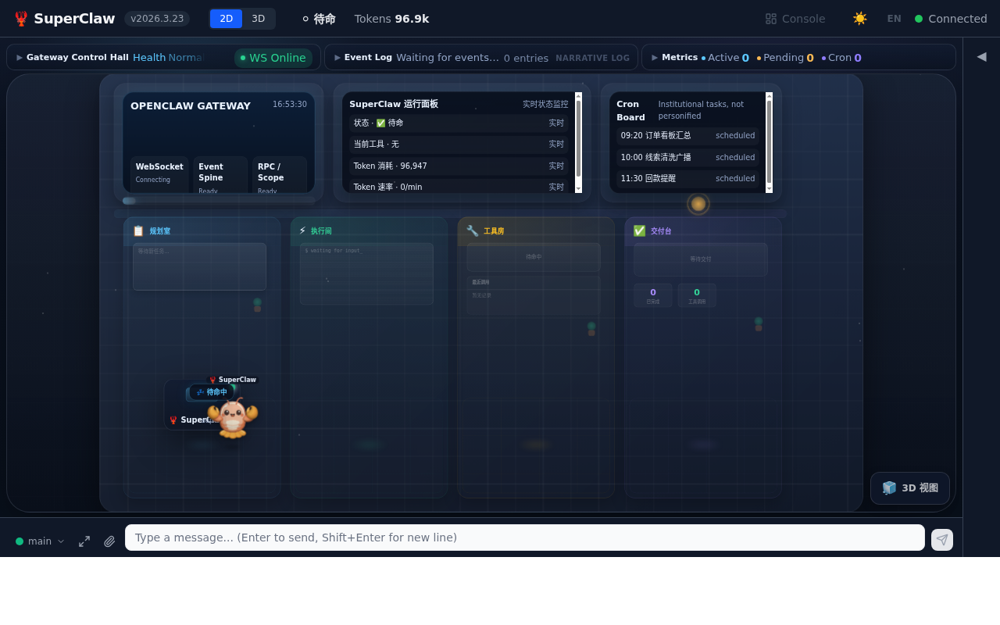
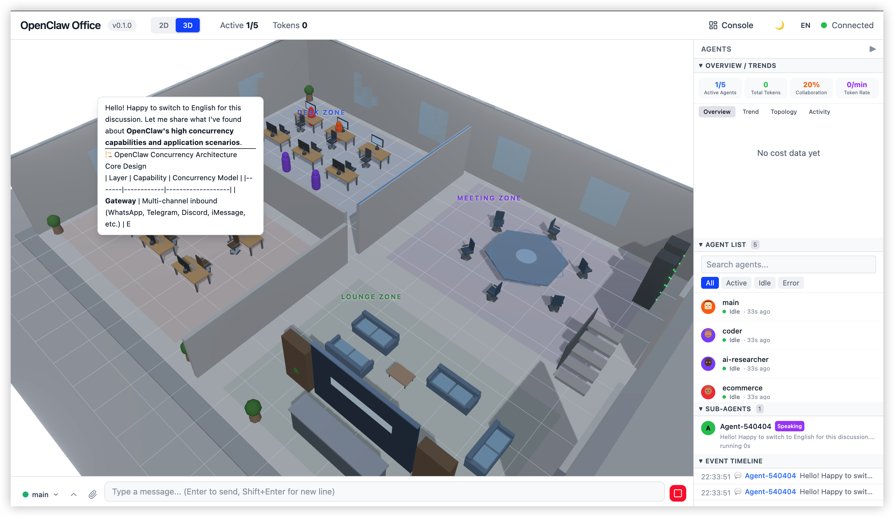

# SuperClaw 🦞

<p align="center">
  
</p>

<p align="center"><b>会自我进化的 AI 助手 · Telegram 驱动 · 内置 300+ Skills</b></p>

<p align="center">
  
  
  
  
  
  
</p>

<p align="center">
  🧠 <a href="#系统架构">架构</a> · 
  🧬 <a href="#进化引擎--superclaw-的灵魂">进化引擎</a> · 
  🛠️ <a href="#300-skills">Skills</a> · 
  🖥️ <a href="#虚拟办公室">虚拟办公室</a> · 
  ⚡ <a href="#快速启动">快速启动</a> ·
  🌐 <a href="README_EN.md">English</a>
</p>

---

## SuperClaw 是什么

SuperClaw 是一个**通过 Telegram 驱动的全能 AI 助手系统**。你在 Telegram 里给它发消息，它就能帮你：写代码、做 PPT、写论文、搜文献、分析数据、爬小红书、理解视频……几乎什么都能干。

但 SuperClaw 不只是一个 Chatbot。它的核心特点是：

- **会自我进化** — 后台运行的进化引擎持续分析每次对话，自动修复出错的能力、增强好用的能力、从成功经验中捕获新能力。**越用越聪明。**
- **不会死** — 对话中断自动续跑，网关挂了自动重启，Webhook 掉了自动重连。全天候在线。
- **300+ 预置技能** — 生物信息学、医学、化学、文献检索、数据科学、文档生成…… 开箱即用。
- **可视化监控** — 2D/3D 虚拟办公室实时展示 AI 工作状态。

### 工作流程

```
你在 Telegram 发消息
    ↓
SuperClaw 理解需求，输出方案
    ↓
你说"可以" → 它开始执行
    ↓
自动查阅相关 Skill → 执行任务 → 自我审查 → 交付结果
    ↓
进化引擎后台分析这次对话，改进 Skill 库
```

**安全机制：** Agent 收到任务后**必须先汇报方案、暂停等你批准**，不会闷头烧钱。

---

## 实际使用案例

### 案例一：生物实验报告

用户发了一组实验数据（考马斯亮蓝法测蛋白质含量），SuperClaw 自动完成：

1. 识别标准曲线、样品浓度、吸光度数据
2. 用 matplotlib 绘制标准曲线和 HW 图，自动标注 R² 值
3. 生成符合论文格式规范的 DOCX 报告（小四宋体、三号黑体标题、图表编号……）
4. 多轮自审修正，检查图表标题、页边距、字号

全程只发了原始数据 + 一句"帮我写实验报告"。

### 案例二：留学申请材料

用户提供成绩单 PDF：

1. 自动解析 PDF，提取课程、绩点、学校信息
2. 撰写 Personal Statement，DOCX 输出
3. 排版单页英文简历，自动调间距
4. 用户反馈后快速迭代 v2、v3

### 案例三：小红书视频理解

1. 用户说"搜一下足球技巧教学的视频"
2. 自动打开浏览器 → 搜索小红书 → 提取 20 条视频笔记
3. 下载视频（11MB）
4. 上传给 Gemini 分析 → 输出详细训练步骤

### 案例四：GWAS 全基因组关联分析

1. 查阅生信 Skill → 使用 R 的 rrBLUP 包
2. 完成 GWAS 分析
3. 生成出版级曼哈顿图 + QQ 图
4. 输出显著 SNP 位点列表

### 案例五：PPT 制作

1. 给出主题和要求
2. 自动搜索资料、组织结构
3. 用 python-pptx 生成 PPT，含图表和排版
4. 自审修正后交付

---

## 系统架构

```
┌─────────────────────────────────────────────────────────────┐
│                      SuperClaw 系统                          │
│                                                              │
│  ┌──────────────────────────────────────────────────────┐   │
│  │                 Telegram Bot 入口                     │   │
│  │  用户消息 → 文件接收 → Webhook 管理 → 通知推送       │   │
│  └──────────────────────┬───────────────────────────────┘   │
│                          │                                    │
│  ┌──────────────────────┴───────────────────────────────┐   │
│  │              OpenClaw Agent 运行时                     │   │
│  │  浏览器操作 · 代码执行 · 文件生成 · 网络搜索          │   │
│  └──────────────────────┬───────────────────────────────┘   │
│                          │                                    │
│  ┌──────────────────────┴───────────────────────────────┐   │
│  │                   支撑服务层                           │   │
│  │  🧬 进化引擎    自动改进 Skill 库                      │   │
│  │  🔄 会话监控    检测中断 → 自动续跑                    │   │
│  │  🐕 看门狗     网关健康监控 → 自动重启                 │   │
│  │  🛡️ Webhook 守护  保持 Telegram 连接                  │   │
│  │  📁 文件代理    Telegram ↔ Agent 文件传输              │   │
│  └──────────────────────┬───────────────────────────────┘   │
│                          │                                    │
│  ┌──────────────────────┴───────────────────────────────┐   │
│  │                 300+ Skills（可插拔）                   │   │
│  │  生信 · 医学 · 化学 · 文献 · 数据科学 · 文档 · 搜索   │   │
│  └──────────────────────────────────────────────────────┘   │
│                                                              │
│  ┌──────────────────────────────────────────────────────┐   │
│  │          任务调度中间件 (FastAPI + SQLite)              │   │
│  │  任务管理 · Agent 注册 · 审查评分 · WebUI 管理后台     │   │
│  └──────────────────────────────────────────────────────┘   │
└─────────────────────────────────────────────────────────────┘
```

### 核心组件

| 组件 | 作用 |
|------|------|
| **Telegram Bot** | 用户交互入口，发消息/文件给 SuperClaw |
| **OpenClaw Agent** | AI 大脑，执行所有任务（代码、浏览器、文件、搜索） |
| **进化引擎** | 后台分析对话，自动进化 Skill 库 |
| **会话监控** | 检测 Agent 中断，自动续跑 |
| **看门狗** | 网关健康监控，挂了自动拉起来 |
| **任务调度** | FastAPI 后端，管理任务队列、Agent 注册、评分系统 |
| **虚拟办公室** | 2D/3D 可视化 Agent 工作状态 |

---

## 进化引擎 — SuperClaw 的灵魂

这是 SuperClaw 和普通 AI 助手最大的区别。**用得越多，越聪明。**

### 三种进化触发

| 触发类型 | 触发条件 | 进化动作 | 举例 |
|---------|---------|---------|------|
| **FIX（修复）** | Skill 被使用但效果差或报错 | LLM 分析错误原因，修补 Skill | PPT Skill 里 python-pptx 报错 → 引擎修复代码模板 |
| **DERIVED（衍生）** | Skill 有效但存在优化空间 | LLM 生成增强版 Skill | 网络搜索 Skill 不够深 → 衍生出带多源交叉验证的增强版 |
| **CAPTURED（捕获）** | 没有匹配的 Skill，但任务成功了 | LLM 从成功对话中提取新 Skill | 手动写的 DOCX 排版流程很好用 → 自动捕获为新 Skill |

### 工作原理

```
Agent 对话历史 → 进化引擎（每 30 秒检查）→ LLM 分析（Gemini Flash，成本低）
    → FIX / DERIVED / CAPTURED → 写入 skills/ 目录 → Agent 自动加载
```

**无需重启，无需人工干预。** Skill 库持续自动进化。

### 真实进化记录

| 原始 Skill | 进化后 | 触发 | 改进 |
|-----------|--------|------|------|
| `adaptive-web-search` | `adaptive-web-search-enhanced` | DERIVED | 多源交叉验证 + 自动翻页 |
| `iterative-ppt-generation` | `iterative-ppt-generation-enhanced` | FIX | 修复 python-pptx 兼容性 |
| _(无)_ | `chinese-standard-docx-styling` | CAPTURED | 从 DOCX 排版 session 中捕获 |
| _(无)_ | `script-driven-docx-composition` | CAPTURED | 从脚本生成 DOCX 的 session 中捕获 |
| _(无)_ | `bio-educational-interpreter` | CAPTURED | 从生物学概念解释 session 中捕获 |

---

## 300+ Skills

每个 Skill 就是一个目录里的 `SKILL.md` 文件（纯 Markdown 提示词），Agent 按需加载。

| 类别 | 数量 | 内容 |
|------|------|------|
| **生信** | 100+ | 基因组学（BLAST、Ensembl、UniProt）、单细胞（Scanpy、AnnData）、蛋白质结构（AlphaFold、ESM）、GWAS、代谢组学 |
| **医学** | 30+ | 临床决策、ClinVar、临床试验、精准肿瘤学、罕见病诊断、药物相互作用 |
| **药学/化学** | 30+ | ChEMBL、RDKit、分子对接、药物设计、ADMET、逆合成 |
| **文献** | 15+ | PubMed 搜索、引文管理、综述写作、科学写作、深度调研 |
| **数据科学** | 40+ | 统计分析、机器学习、可视化、R 语言 |
| **通用** | 40+ | PPT、DOCX、搜索、视频理解、图像分析、论文写作 |

```
skills/
├── labclaw-bio-bioinformatics/
│   └── SKILL.md              # Skill 提示词
├── labclaw-bio-scanpy/
│   └── SKILL.md
├── labclaw-pharma-rdkit/
│   └── SKILL.md
└── ...（300+ 个目录）
```

---

## 虚拟办公室

实时可视化 Agent 工作状态的前端（`office/` 目录）：



- **2D 平面图** — 等距办公室，Agent 头像 + 实时状态动画
- **3D 场景** — Three.js 3D 办公室，角色模型 + Skill 全息投影
- **实时监控** — Token 用量、费用图表、协作连线
- **聊天界面** — 直接从 UI 向 Agent 发消息



---

## 支撑服务

| 服务 | 文件 | 功能 |
|------|------|------|
| **进化引擎** | `evolution-engine.py` | 分析对话 → 自动修复/衍生/捕获 Skill |
| **会话监控** | `session-watcher.py` | 检测 Agent 中断 → 自动续跑 → Telegram 通知 |
| **看门狗** | `watchdog.py` | 网关进程监控 → 自动重启 → 重注册 Webhook |
| **Webhook 守护** | `webhook-guardian.py` | Telegram Webhook 健康检查 → 自动重连 |
| **文件代理** | `telegram-file-proxy.py` | Telegram ↔ Agent 文件传输桥接 |
| **Token 管理** | `scite-token-manager.py` | Scite.ai 学术搜索 token 管理 |

---

## 快速启动

### 环境要求

- Python 3.10+
- [OpenClaw](https://github.com/openclaw/openclaw) 已安装配置
- Telegram Bot（通过 @BotFather 创建）
- Node.js 18+（仅构建前端时需要）

### 安装与运行

```bash
# 1. 克隆项目
git clone https://github.com/luokehan/superclaw.git
cd superclaw

# 2. 安装依赖
pip install -r requirements.txt

# 3. 启动服务
python -m uvicorn app.main:app --host 0.0.0.0 --port 6565
```

首次启动访问 `http://localhost:6565`，设置向导引导你完成配置。

### 启动支撑服务

```bash
python evolution-engine.py &       # 进化引擎
python session-watcher.py &        # 会话监控
python watchdog.py &               # 看门狗
python webhook-guardian.py &       # Webhook 守护
```

### 配置

复制 `config.example.yaml` 为 `config.yaml`：

```yaml
project:
  name: "SuperClaw"

admin:
  password: "你的密码"

agent:
  registration_token: "你的随机令牌"

notification:
  enabled: true
  channels:
    - type: telegram
      bot_token: "你的_BOT_TOKEN"
      chat_id: "你的_CHAT_ID"

server:
  port: 6565
  host: "0.0.0.0"

database:
  type: sqlite
  path: "./data/tasks.db"

workspace:
  root: "/你的/工作目录"
```

---

## Workspace 配置模板

`workspace-templates/` 目录包含 Agent 行为配置示例：

| 文件 | 作用 |
|------|------|
| `AGENTS.md` | Agent 行为规范、格式标准、工作流约束 — **最核心** |
| `SOUL.md` | Agent 人格、能力清单、语气风格 |
| `TOOLS.md` | 可用工具说明 |
| `USER.md` | 用户偏好 |

放在 `~/.openclaw/workspace/`，决定 Agent 的一切行为。

---

## API 文档

启动后访问 `http://localhost:6565/docs` 查看 Swagger 文档。

| 身份 | Header | 说明 |
|------|--------|------|
| Agent | `X-Agent-Key: <api_key>` | 注册后获得 |
| 管理员 | `X-Admin-Token: <token>` | 登录返回 |

---

## 项目结构

```
SuperClaw/
├── app/                          # 后端 (FastAPI)
├── skills/                       # 300+ Agent Skills
├── office/                       # 虚拟办公室 (React + Three.js)
├── webui/                        # 管理后台 (Vue 3)
├── static/                       # 构建后的前端
├── prompts/                      # Agent 角色提示词
├── workspace-templates/          # Workspace 配置示例
│
├── evolution-engine.py           # 🧬 进化引擎
├── session-watcher.py            # 🔄 会话监控
├── watchdog.py                   # 🐕 看门狗
├── webhook-guardian.py           # 🛡️ Webhook 守护
├── telegram-file-proxy.py        # 📁 文件代理
├── telegram-file-watcher.py      # 📁 文件监控
├── scite-token-manager.py        # 🔑 Token 管理
│
├── config.example.yaml           # 配置模板
├── requirements.txt              # Python 依赖
└── LICENSE                       # MIT License
```

---

## 技术栈

| 层 | 技术 |
|----|------|
| 后端 | Python 3.10+ / FastAPI / SQLAlchemy / SQLite |
| 管理后台 | Vue 3 / TypeScript / Tailwind CSS / shadcn-vue |
| 虚拟办公室 | React / Three.js / React Three Fiber |
| Agent 运行时 | OpenClaw |
| 进化引擎 LLM | Gemini Flash / Grok Mini（轻量低成本） |
| 消息渠道 | Telegram Bot API |

---

## License

[MIT](LICENSE)
