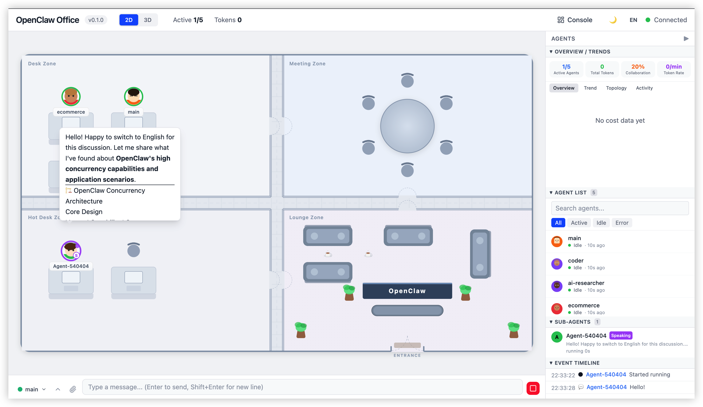

# SuperClaw 🦞

<p align="center">
  
</p>

<p align="center"><b>Self-Evolving AI Assistant · Telegram-Driven · 300+ Built-in Skills</b></p>

<p align="center">
  
  
  
  
  
  
</p>

> **An AI assistant that evolves itself.** SuperClaw is a Telegram-driven AI system with 300+ skills, self-healing capabilities, and an evolution engine that continuously improves its skill library by analyzing past conversations.

🇨🇳 [中文文档](README.md)

---

## What is SuperClaw

SuperClaw is a **Telegram-powered AI assistant** that can write code, create presentations, draft papers, search literature, analyze data, scrape social media, understand videos — and more.

Key differentiators:

- **Self-Evolution** — Background engine analyzes every conversation, auto-fixes broken skills, enhances good ones, captures new patterns
- **Self-Healing** — Auto-recovers interrupted sessions, auto-restarts crashed gateways, auto-reconnects webhooks
- **300+ Pre-built Skills** — Bioinformatics, medical, chemistry, literature, data science, document generation
- **Visual Monitoring** — 2D/3D virtual office shows AI work in real-time

## Quick Start

```bash
git clone https://github.com/luokehan/superclaw.git
cd superclaw
pip install -r requirements.txt
python -m uvicorn app.main:app --host 0.0.0.0 --port 6565
```

See the [Chinese README](README.md) for detailed documentation.

## License

[MIT](LICENSE)
